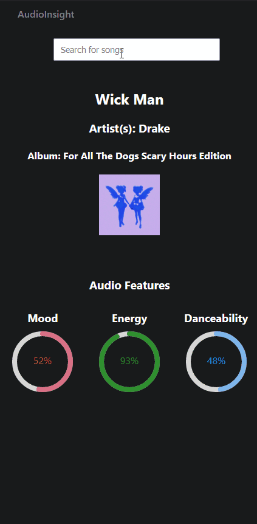

## AudioInsight

## Overview
A web application designed to display a select few metrics from [Spotify's Audio Features](https://developer.spotify.com/documentation/web-api/reference/get-audio-features)

## Features
- **Search Functionality**: Allows users to search for tracks using the Spotify API.
- **Audio Feature Visualization**: Displays metrics such as Mood, Energy, and Danceability in a visual format.
- **Responsive Design**: Ensures the app is usable on both desktop and mobile devices.

